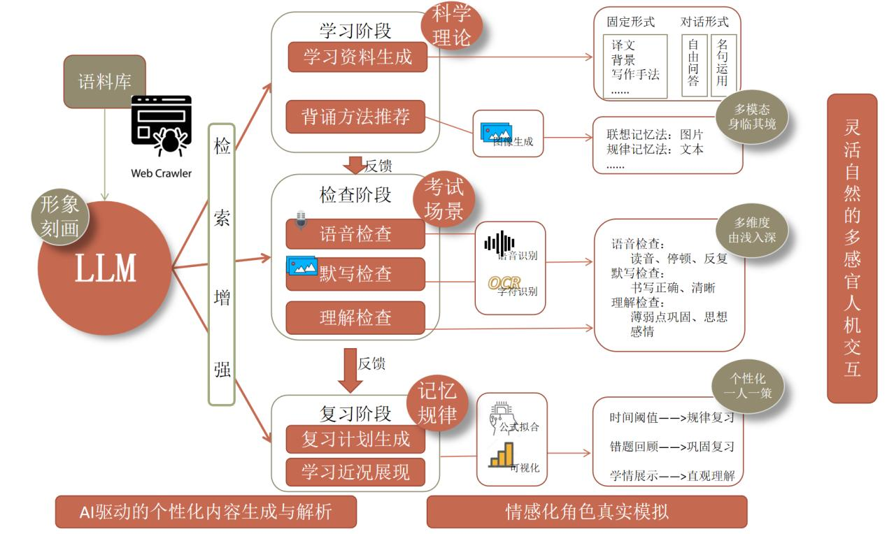
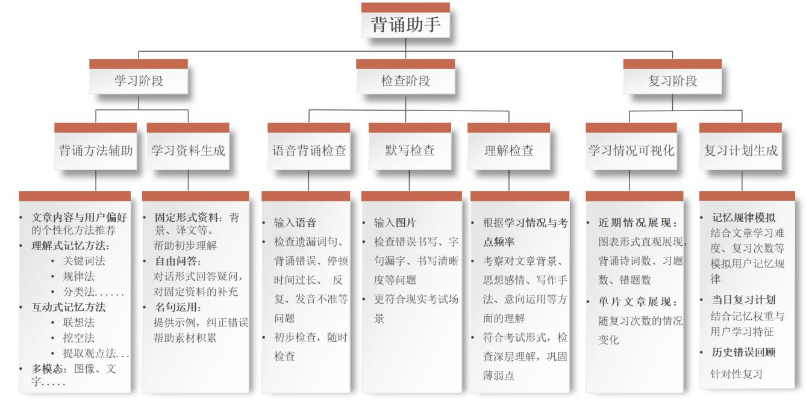
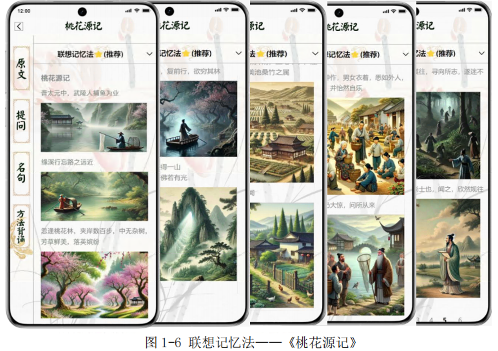
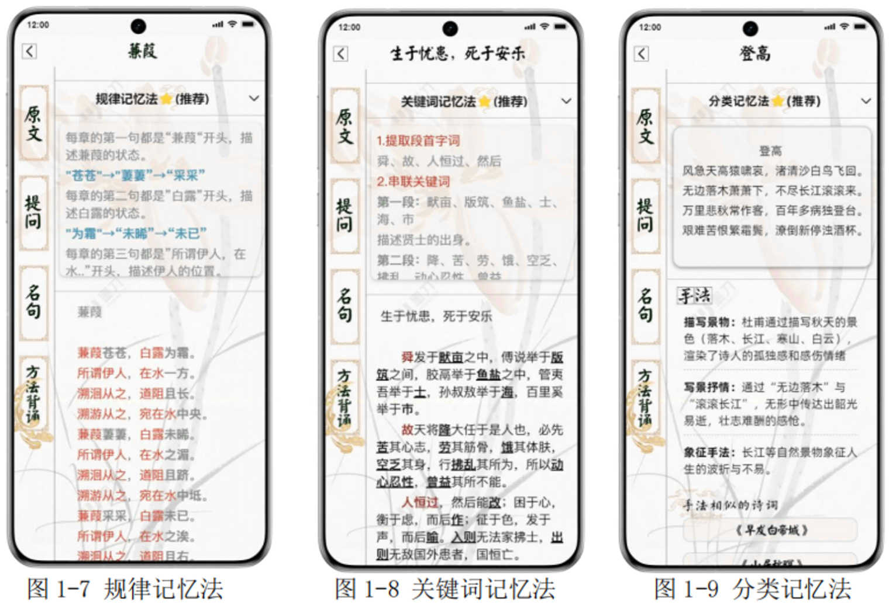
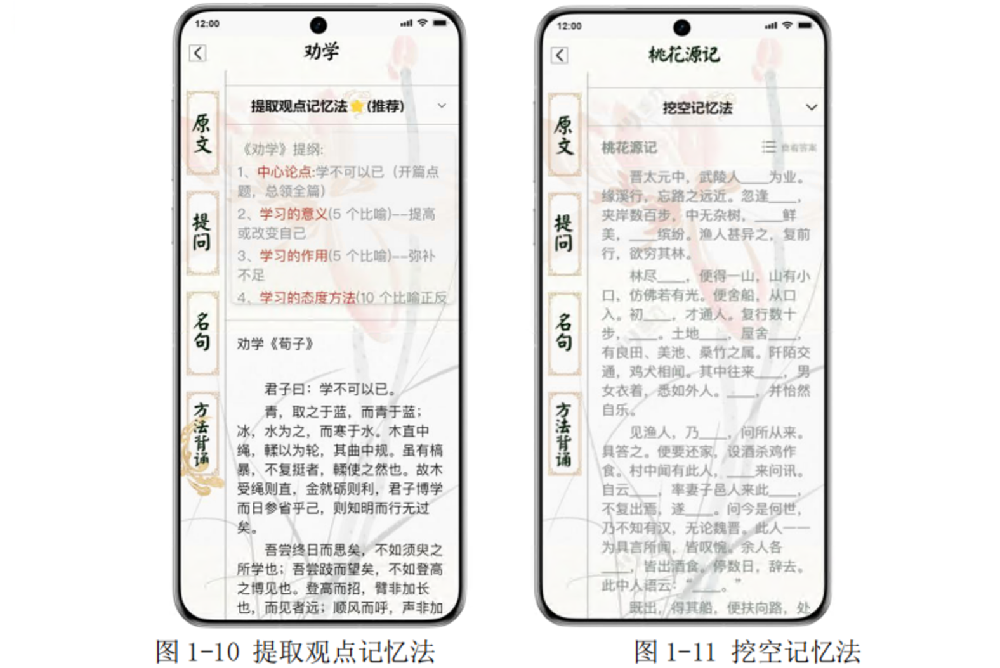
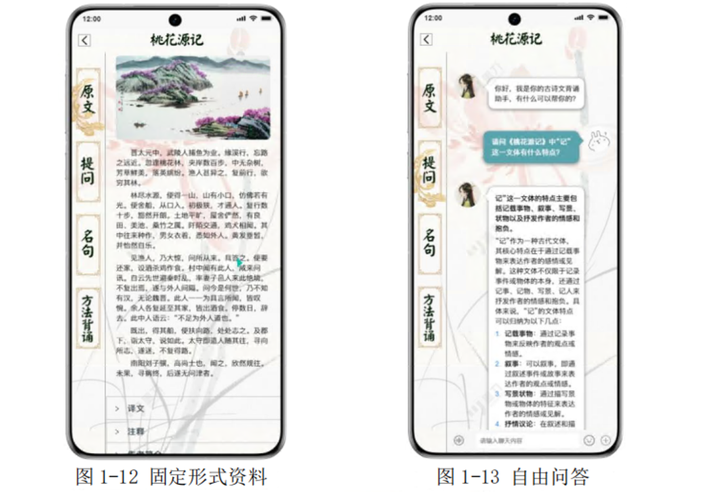
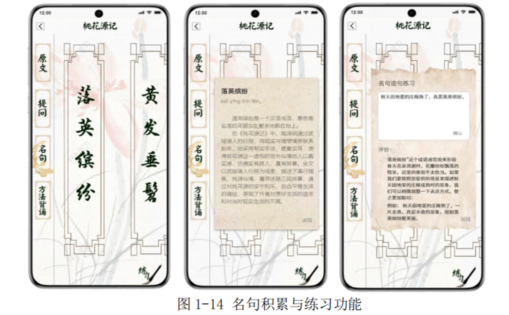
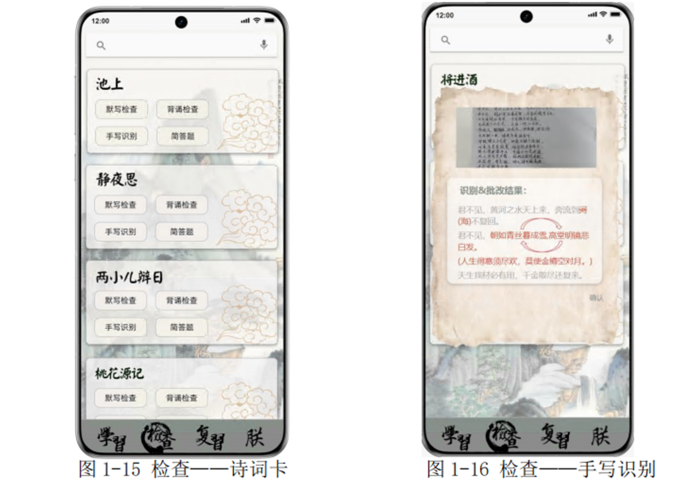
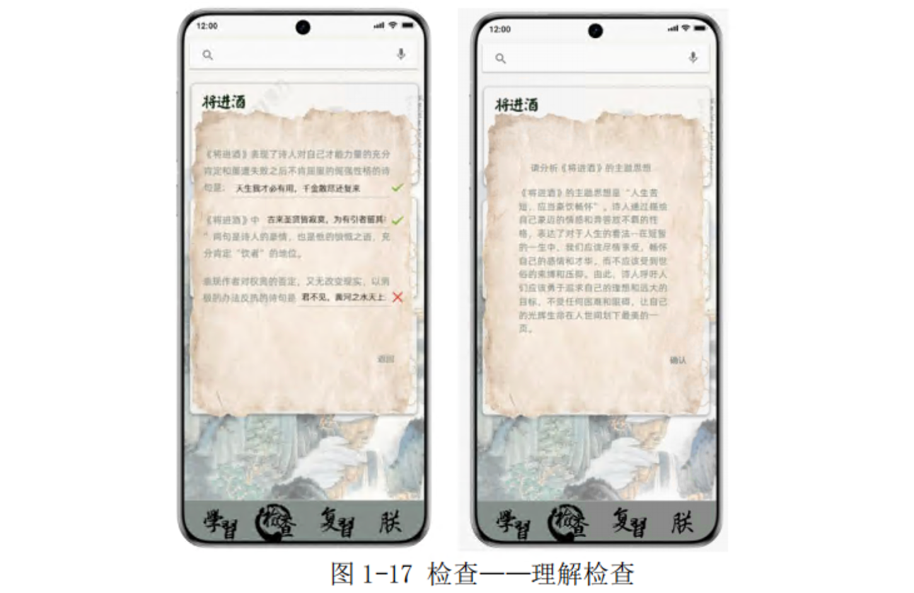
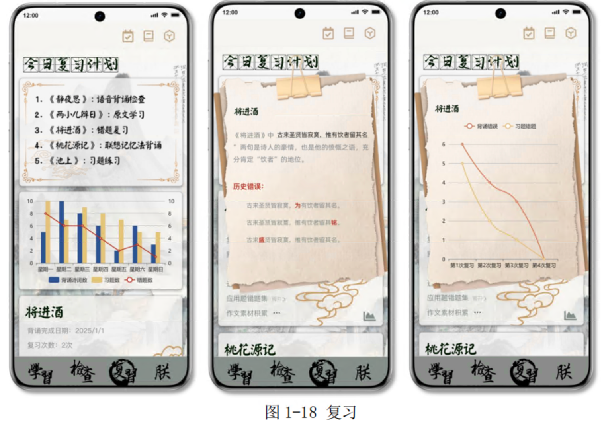

# 雅韵智诵

荣获第三届(2024年)“中国高校计算机大赛-智能交互创新赛”全国总决赛 <font color=purple>特等奖</font> 

## 功能演示

雅韵智诵app的功能演示视频见 `功能演示视频.mp4`

## 技术架构



## 项目介绍

本项目功能对应于古诗文学习的三个阶段：学习、检查、复习。



### 学习阶段

在学习阶段，系统首先提供“每日精选”与“专题分类”（图 1-4）两个页面，每日精选根据用户当前学习进度及热门考点推送相关古诗文；“专题分类”则支持用户根据写作手法、文章体裁等分类，或根据自己的学习进度按教材检索相关古诗文进行学习。


对于选定的特定古诗文，背诵助手提供两种功能：一是基于科学理论与用户偏好的背诵辅助，二是基于文章具体内容的个性化学习资料生成。

**① 背诵方法辅助**

记忆分为机械记忆和理解记忆，后者和积极的思维有密切关系。本助手提供一系列理解记忆方法及互动记忆方法，如图 1-5，助手首先通过文章内容、体裁等特征提供最合适的背诵方法，用户也可根据自身情况选择喜欢的背诵方法。


**理解式记忆方法**具体分为如下几种类型：①分类记忆法：对内容进行分类，将同类古诗文放在一起进行记忆。②规律记忆法：找出文章结构之间的联系和规律，从而帮助记忆。③关键词记忆法：重点强调关键字帮助记忆，基于关键词联系文章内容与结构。

**互动记忆方法**具体分为如下几种类型：①联想记忆法：提取关键意象并且根据上下文的场景描述生成对应的图片，建立从文字到图片的直观联系，帮助记忆。②提取观点记忆法：适用于背诵议论文类型的文言文。通过梳理关于论点、论据和论证的相关段落，帮助用户理解文章逻辑结构，梳理脉络。③挖空记忆法：根据用户以往学习情况及高考点频率，动态生成空白，帮助用户在填空中巩固薄弱点。

针对特定的古诗文，系统将根据其内容或体裁等不同特点，推荐最合适的背诵方法（如图 1-5 中星号所示）。

“联想记忆法”适用于意象丰富、场景描写较多、故事情节连贯的古诗文，如《桃花源记》。如图 1-6 所示，通过提取关键意象，系统结合上下文语境生成句子图片，“联想记忆法”帮助用户直观感受“忘路之远近”时环境的幽深迷惘，桃花林“芳草鲜美，落英缤纷”的绚丽灿烂，桃花源“土地平旷，屋舍俨然，黄发垂髫，并怡然自乐”的平静祥和。同时，通过图片的变化，“逢桃林--入桃源--桃花源人生活--出桃源--寻桃源--寻找未果。”的故事脉络也变得格外连贯清晰了。



“规律记忆法”适合于《诗经·蒹葭》等行文结构具有明显规律的古诗文，如图 1-7，通过总结各段相似结构，并分析差异，背诵时需要额外记忆的内容大大减少，背诵效率显著提高。

“关键词记忆法”适用于篇幅较短、每段围绕中心词进行展开的古诗文，如《生于忧患，死于安乐》。如图 1-8，“关键词记忆法”首先顺应大脑记忆规律，强调句首词，帮助建立记忆起点，然后结合段落意思与结构提取关键词，串联关键词形成完整记忆。以第一段为例，围绕“贤士出身”的中心点，“畎亩”、“筑”表示职业的词语就很容易被记住了。

“分类记忆法”对于结构化知识体系具有重要的作用。对于《登高》这类主旨感情非常典型，写作手法丰富的古诗文，如图 1-9，“分类记忆法”通过总结文章特征进行发散思维，将“写景抒情”的写作手法与“感怀伤己”的感情拓展到相似的文章中去，在对比中培养分类思维，形成宏观记忆，对于素材的积累与文学素养的培养都大有裨益。





“提取观点记忆法”适用于背诵议论文类型的文言文。通过提取论点、论证方式、支持论证实例和事实，分析文章的结构，帮助记忆。《劝学》作为一篇议论性文章，具有非常鲜明的论证结构。通过提取各个段落的观点，如图 1-10，“提取观点记忆法”首先帮助用户明确“学不可以已”的论点，然后引导用户在文中找到支持论点的论据，在这个过程中体会完整的论证过程。

“挖空记忆法”是非常经典的背诵方法，如图 1-11，在本应用中，我们在传统方法上进行拓展，利用智能体的记忆优势，根据用户以往学习中的错误情况及知识库中考点出现频率，有针对性的动态更改每次的挖空位置，帮助用户实现真正个性化的弱点巩固。

结合智能体的文本理解与生成、上下文学习及对话与记忆能力，背诵助手能够适应各种类型的古诗文类型及背诵需要，从视觉、文字等多个模态激发用户的记忆点，提供科学的、多样化的背诵辅助，帮助用户加深对文章的背景与思想感情的体会，增强对文章逻辑思路、行文结构和写作手法的学习，掌握类比、总结的技能，从而将阅读和背诵技巧拓展到日常的学习过程中去。

**② 学习资料生成**

背诵助手以三种形式为用户生成学习资料：首先是文章背景、译文、注释等固定类型的知识，帮助用户对文章进行初步的理解，如图 1-12。



其次是通过自由问答形式回答用户的疑问，如图 1-13，在学习过程中，用户可能对文章的任何部分或相关知识产生疑问，对于有限的固定形式的资料来说，这些问题往往难以得到解答，而利用 LLM 的对话能力和强大的知识储备，则可以较为容易地为用户提供知识的补充，从而弥补传统应用场景下固定形式知识的局限性。

最后是名句的写作示例与纠错，古诗文是是初高中学生重要的写作素材。在写作中引用名句名篇，不仅提升了语言的美感，也将展示作者深厚的文学素养。然而，在课堂上对于如何根据文章的情景主题引用句子往往讲授的比较粗略，学生也常常因为对句子意思的理解不够深入而导致误用，在“名句积累”功能中（图1-14），大模型根据知识库及句子使用频率自动选择“成语”或“名句”，以书签形式进行展示（图 1-14 左 1），点击书签可以查看具体解释与用法（图 1-14左 2），应用鼓励用户根据名句进行写作练习，并将通过智能体实时给出反馈（图1-14 左 3），帮助用户纠正错误理解，巩固素材积累。



### 检查阶段

在检查阶段，应用根据已学习的古诗文提供诗词卡（图 1-15），用户可以通过“默写检查”按钮上传默写图片，模拟真实考场检查；可以通过“背诵检查”、“选择题”、“简答题”几个按钮，以不同形式和层面考察对文章的理解。对于其他想要检验背诵或理解的文章，也可通过下方加号自行检索添加，应用将根据文章内容自动生成习题。背诵助手根据用户的背诵情况，提供两方面的检查，帮助用户独立全面地检验自己的背诵成果，为错误纠正提供更有针对性的建议。

**① 默写检查**

在现有的各种应用中，都缺少考察用户对书写的掌握。然而，古诗文通常包含较多生僻字，掌握读音并不能代表已经掌握了相应文字的写法，古诗文最终是以文字的形式提现到试卷上，文字书写的正确性和清晰程度都会影响最终的得分。本助手提供手写识别功能（图 1-16），用户拍照上传默写，助手使用 OCR 技术检查错别字及遗漏情况。



**② 理解检查**

除了书写与背诵，古诗文的阅读理解也是考试的重要形式。本助手可以根据文章内容以及用户此前的学习情况，生成类型丰富的相关习题（图 1-17），包括理解性默写和简答，从而考察对文章背景、思想感情、写作手法、意向运用等方面的理解，帮助用户从更深层次掌握知识。



### 复习阶段

人类的记忆包括短时记忆和长期记忆，一次背诵的完成通常只能获得短时记忆。短时记忆中的信息通过复习、联想、重复和深度加工等策略可以转化为长期记忆。这个过程称为记忆巩固，是记忆持久化的关键步骤。



在复习阶段，背诵助手基于用户学习情况以及记忆规律理论生成个性化复习计划。如图 1-18，助手基于已学习古诗文的情况，提供三个方面的功能：①学习情况可视化：针对用户近期的学习近况和特定课文的学习情况，包括背诵完成日期、复习次数及错题数，助手通过条形图与折线图进行可视化展现，帮助用户对自身情况建立直观理解；②错题重点复习：针对特定的古诗文，助手将对错误部分进行重点复习，记录每一次的错误，提高错误部分的提问频率，错误问题连续答对多次才可移出错题集；③当日复习计划生成：最后背诵助手将综合以上学习记录，结合我们拟合的遗忘曲线记忆公式，制定适合于用户情况和记忆规律的每日复习计划，进行有针对性的复习。


## 使用说明

修改`api`文件中的`api_key`，路径如下：

```bash
app/src/main/java/com/example/yypome/myapi/MyApi.java
```

> 注意：其中的oppo开放平台api在比赛结束后关闭了，可以自行修改为其他可以生成图像和文本的MLLMs。